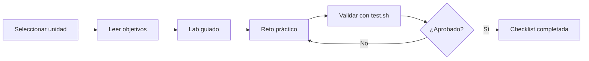

# Administración de Servidores Linux — Propuesta Pedagógica

Curso práctico de **11 unidades progresivas** que cubre desde fundamentos Linux hasta orquestación con Docker Compose. Cada unidad integra teoría, laboratorio guiado, retos de evaluación automática y autoevaluación. Aproximación **"aprender haciendo"** con validación inmediata.

## Quick path

| Unidad | Tema | Tiempo | Retos |
|--------|------|--------|-------|
| I | Fundamentos y FHS | 45 min | 2 |
| II | Gestión de paquetes APT | 45 min | 2 |
| III | Scripting Bash | 60 min | 2 |
| IV | Usuarios, grupos y SSH | 45 min | 2 |
| V | Procesos y systemd | 60 min | 2 |
| VI | Almacenamiento y LVM | 60 min | 2 |
| VII | Hardening del sistema | 45 min | 2 |
| VIII | Contenedores con Docker | 60 min | 2 |
| IX | Servidor web Nginx | 45 min | 2 |
| X | Certificados SSL/TLS | 45 min | 2 |
| XI | Docker Compose y BD | 60 min | 2 |

**Total estimado:** 11 unidades × 45–150 min cada una.

## Flujo por unidad



## Estructura estándar

Cada unidad sigue esta estructura:

1. **Objetivos** — Qué sabrás hacer al terminar
2. **Ruta de aprendizaje** — Tres niveles: básico, intermedio, avanzado
3. **Laboratorio** — Instrucciones paso a paso ejecutables
4. **Reto** — Escenario práctico con validación automática
5. **Checklist** — Autoevaluación de competencias

## Proyecto integrador

Al finalizar las 11 unidades, el estudiante despliega un **servidor web completo** que incluye hardening, Nginx, HTTPS, Docker Compose, base de datos y automatización de backups.

---

# UNIDAD I — Fundamentos de Linux y WSL2

> Sin fundamentos sólidos, no hay administración segura.

## Objetivos

- [ ] Navegar el sistema de archivos con confianza
- [ ] Explicar la jerarquía FHS
- [ ] Configurar WSL2 como entorno de desarrollo
- [ ] Ejecutar comandos básicos del sistema de archivos

## Ruta de aprendizaje

| Nivel | Contenido | Tiempo |
|-------|-----------|--------|
| Básico | Navegación FHS + comandos esenciales | 45 min |
| Intermedio | Configuración WSL2 + permisos | 60 min |
| Avanzado | Integración Git + scripts de inicio | 90 min |

## Lab 1.1 — Exploración del sistema de archivos

```bash
# 1. Ubicación actual
pwd

# 2. Explorar FHS
ls -la /etc        # Configuración del sistema
ls -la /var        # Variables (logs, caché)
ls -la /tmp        # Temporales
ls -la /usr        # Programas de usuario

# 3. Crear directorio de trabajo
mkdir -p ~/laboratorio/fundamentos
cd ~/laboratorio/fundamentos
echo "Hola Linux" > saludo.txt
cat saludo.txt
```

## Reto 1.1 — Navegación avanzada

**Objetivo:** Navegar entre directorios sin usar `cd` explícitamente.

**Requisitos:**
1. Mostrar tu directorio actual
2. Mostrar el contenido de `/etc/os-release`
3. Contar archivos en `/usr/bin`
4. Mostrar espacio disponible en disco

**Validación:** El script debe producir salida con los cuatro elementos anteriores.

## Checklist Unidad I

- [ ] Navego la jerarquía FHS sin ayuda
- [ ] Entiendo la diferencia entre `/etc`, `/var`, `/usr`
- [ ] Creo y manipulo archivos con comandos básicos
- [ ] Completé el Reto 1.1 exitosamente

---

# UNIDAD II — Gestión de Paquetes y APT

> Un sistema desactualizado es un sistema vulnerable.

## Objetivos

- [ ] Administrar paquetes con APT
- [ ] Configurar repositorios y claves GPG
- [ ] Gestionar dependencias y resolver conflictos
- [ ] Usar Git para control de versiones básico

## Ruta de aprendizaje

| Nivel | Contenido | Tiempo |
|-------|-----------|--------|
| Básico | Comandos APT esenciales | 45 min |
| Intermedio | Repositorios + claves GPG | 75 min |
| Avanzado | Script de actualización automática | 90 min |

## Lab 2.1 — Gestión de paquetes

```bash
# 1. Actualizar índices
sudo apt update

# 2. Verificar actualizaciones
apt list --upgradable

# 3. Instalar paquetes esenciales
sudo apt install -y curl wget git vim htop

# 4. Buscar paquete específico
apt search nginx | head -10

# 5. Verificar instalación
which curl && curl --version

# 6. Limpiar caché
sudo apt clean
sudo apt autoremove
```

## Reto 2.1 — Configuración de repositorio

**Objetivo:** Configurar un repositorio personalizado para Node.js.

**Requisitos:**
1. Importar la clave GPG oficial
2. Agregar el repositorio al sistema
3. Instalar Node.js LTS
4. Verificar con `node -v` y `npm -v`

**Validación:** Node.js y npm están instalados y accesibles en el PATH.

## Checklist Unidad II

- [ ] Instalo, actualizo y elimino paquetes con APT
- [ ] Entiendo cómo funcionan los repositorios
- [ ] Agrego claves GPG y repositorios externos
- [ ] Git está configurado y funcionando
- [ ] Completé el Reto 2.1 exitosamente

---

# UNIDAD III — Scripting Bash

> La automatización es la diferencia entre trabajar en Linux y que Linux trabaje para ti.

## Objetivos

- [ ] Escribir scripts Bash con estructura correcta
- [ ] Usar variables, condicionales y bucles
- [ ] Procesar argumentos de línea de comandos
- [ ] Crear scripts de mantenimiento del sistema

## Ruta de aprendizaje

| Nivel | Contenido | Tiempo |
|-------|-----------|--------|
| Básico | Estructura de scripts + variables | 60 min |
| Intermedio | Condicionales + funciones | 90 min |
| Avanzado | Script de backup automatizado | 120 min |

## Lab 3.1 — Tu primer script

```bash
# 1. Crear el script
cat > ~/laboratorio/hola.sh << 'EOF'
#!/bin/bash
echo "Hola, $USER!"
echo "Fecha: $(date '+%d/%m/%Y %H:%M')"
EOF

# 2. Permisos de ejecución
chmod +x ~/laboratorio/hola.sh

# 3. Ejecutar
~/laboratorio/hola.sh
```

## Reto 3.1 — Script de monitoreo

**Objetivo:** Crear un script que registre el estado del sistema.

**Requisitos:**
1. Mostrar uso de CPU, memoria y disco
2. Listar los 5 procesos que más CPU consumen
3. Mostrar conexiones de red activas
4. Guardar todo en un archivo de log con timestamp

**Validación:** El script ejecuta sin errores y genera un archivo de log con las secciones solicitadas.

## Checklist Unidad III

- [ ] Creo scripts con shebang correcto
- [ ] Uso variables del sistema y del usuario
- [ ] Implemento condicionales `if/else`
- [ ] Creo funciones reutilizables
- [ ] Completé el Reto 3.1 exitosamente

---

# UNIDAD IV — Gestión de Usuarios y SSH

> Cada usuario es una puerta de entrada; adminístralas con cuidado.

## Objetivos

- [ ] Crear, modificar y eliminar usuarios
- [ ] Gestionar grupos y permisos
- [ ] Configurar autenticación SSH con claves
- [ ] Entender el módulo PAM para autenticación

## Ruta de aprendizaje

| Nivel | Contenido | Tiempo |
|-------|-----------|--------|
| Básico | CRUD de usuarios + grupos | 45 min |
| Intermedio | Configuración SSH + claves | 75 min |
| Avanzado | Configuración PAM + hardening SSH | 105 min |

## Lab 4.1 — Gestión de usuarios

```bash
# 1. Crear usuario de prueba
sudo useradd -m -s /bin/bash labuser
sudo passwd labuser

# 2. Crear grupo de laboratorio
sudo groupadd laboratorio
sudo usermod -aG laboratorio labuser

# 3. Verificar membresía
groups labuser

# 4. Cambiar ownership
sudo chown -R labuser:laboratorio /home/labuser

# 5. Configurar permisos
sudo chmod 750 /home/labuser
```

## Reto 4.1 — Configuración SSH segura

**Objetivo:** Configurar acceso SSH con autenticación por claves.

**Requisitos:**
1. Generar par de claves Ed25519
2. Copiar la clave pública al servidor
3. Desactivar login con contraseña
4. Configurar usuario sin privilegios sudo
5. Verificar la conexión

**Validación:** SSH acepta conexiones solo con clave; `PasswordAuthentication` está desactivado.

## Checklist Unidad IV

- [ ] Creo y gestiono usuarios con `useradd`/`usermod`
- [ ] Entiendo la estructura de `/etc/passwd` y `/etc/shadow`
- [ ] Configuré SSH con autenticación por claves
- [ ] Desactivé el login por contraseña en SSH
- [ ] Completé el Reto 4.1 exitosamente

---

# UNIDAD V — Gestión de Procesos y systemd

> Controla tus procesos o ellos te controlarán a ti.

## Objetivos

- [ ] Monitorear y gestionar procesos en tiempo real
- [ ] Configurar servicios con systemd
- [ ] Crear unidades de servicio personalizadas
- [ ] Programar tareas con cron y systemd timers

## Ruta de aprendizaje

| Nivel | Contenido | Tiempo |
|-------|-----------|--------|
| Básico | Monitoreo + señales de procesos | 60 min |
| Intermedio | Systemd + timers | 90 min |
| Avanzado | Servicio personalizado + logging | 120 min |

## Lab 5.1 — Monitoreo de procesos

```bash
# 1. Ver procesos en tiempo real
top

# 2. Buscar proceso específico
ps aux | grep nginx

# 3. Matar proceso por nombre
pkill -f "proceso_prueba"

# 4. Ver árbol de procesos
pstree

# 5. Verificar procesos zombie
ps aux | grep -w Z
```

## Reto 5.1 — Servicio systemd personalizado

**Objetivo:** Crear un servicio que ejecute un script cada 5 minutos.

**Requisitos:**
1. Ejecutar un script de monitoreo cada 5 minutos
2. Registrar logs en el journal del sistema
3. Reiniciar automáticamente si falla
4. Iniciar al arrancar el sistema

**Validación:** `systemctl status tu-servicio` muestra `active (running)` y el journal contiene entradas recientes.

## Checklist Unidad V

- [ ] Monitoreo procesos con `top`, `ps`, `htop`
- [ ] Entiendo las señales de procesos (SIGTERM, SIGKILL)
- [ ] Creo unidades systemd personalizadas
- [ ] Programo tareas con cron o systemd timers
- [ ] Completé el Reto 5.1 exitosamente

---

# UNIDAD VI — Gestión de Almacenamiento y LVM

> Los datos sin respaldo son datos en espera de perderse.

## Objetivos

- [ ] Administrar sistemas de archivos (ext4, XFS)
- [ ] Configurar y gestionar LVM
- [ ] Crear y montar particiones
- [ ] Implementar estrategias de respaldo

## Ruta de aprendizaje

| Nivel | Contenido | Tiempo |
|-------|-----------|--------|
| Básico | Montaje + gestión de discos | 60 min |
| Intermedio | LVM completo (PV → VG → LV) | 105 min |
| Avanzado | Snapshot + backup automatizado | 135 min |

## Lab 6.1 — Gestión de discos

```bash
# 1. Ver discos disponibles
lsblk
sudo fdisk -l

# 2. Crear disco virtual
dd if=/dev/zero of=~/laboratorio/disk.img bs=1M count=100

# 3. Formatear con ext4
sudo mkfs.ext4 ~/laboratorio/disk.img

# 4. Crear punto de montaje
sudo mkdir -p /mnt/laboratorio

# 5. Montar el disco virtual
sudo mount ~/laboratorio/disk.img /mnt/laboratorio

# 6. Verificar montaje
df -h /mnt/laboratorio
mount | grep laboratorio
```

## Reto 6.1 — Configuración LVM

**Objetivo:** Configurar un entorno LVM completo.

**Requisitos:**
1. Crear 3 discos virtuales de 50MB cada uno
2. Inicializarlos como Physical Volumes (PV)
3. Crear un Volume Group (VG) llamado `datos`
4. Crear un Logical Volume (LV) de 100MB
5. Formatear y montar el LV
6. Agregar un cuarto disco y extender el LV

**Validación:** `vgs`, `lvs`, y `mount` muestran el VG y LV correctamente configurados.

## Checklist Unidad VI

- [ ] Creo y monto sistemas de archivos
- [ ] Entiendo la arquitectura LVM (PV → VG → LV)
- [ ] Extiendo volúmenes LVM sin perder datos
- [ ] Implementé un respaldo básico con `rsync`
- [ ] Completé el Reto 6.1 exitosamente

---

# UNIDAD VII — Hardening del Sistema

> La seguridad no es un producto, es un proceso.

## Objetivos

- [ ] Aplicar benchmarks de seguridad (CIS)
- [ ] Configurar firewalls (UFW/iptables)
- [ ] Implementar detección de intrusos (fail2ban)
- [ ] Auditar permisos y configuraciones

## Ruta de aprendizaje

| Nivel | Contenido | Tiempo |
|-------|-----------|--------|
| Básico | UFW + actualizaciones de seguridad | 45 min |
| Intermedio | fail2ban + auditoría de permisos | 90 min |
| Avanzado | CIS Benchmark + auditoría completa | 135 min |

## Lab 7.1 — Firewall con UFW

```bash
# 1. Verificar estado actual
sudo ufw status verbose

# 2. Configurar políticas por defecto
sudo ufw default deny incoming
sudo ufw default allow outgoing

# 3. Permitir SSH
sudo ufw allow ssh

# 4. Permitir HTTP y HTTPS
sudo ufw allow 80/tcp
sudo ufw allow 443/tcp

# 5. Activar el firewall
sudo ufw enable

# 6. Verificar reglas
sudo ufw status numbered
```

## Reto 7.1 — Configuración fail2ban

**Objetivo:** Proteger el servidor con fail2ban.

**Requisitos:**
1. Instalar fail2ban
2. Crear una jail personalizada para SSH
3. Configurar ban después de 3 intentos fallidos
4. Establecer un tiempo de ban de 1 hora
5. Crear una jail para Nginx (anti-scraping)
6. Verificar que funciona con logs

**Validación:** `fail2ban-client status sshd` muestra la jail activa y el archivo `jail.local` contiene los parámetros correctos.

## Checklist Unidad VII

- [ ] UFW está activo con políticas restrictivas
- [ ] fail2ban protege SSH y servicios web
- [ ] Leo e interpreto logs de seguridad
- [ ] Audito permisos con `find` y `stat`
- [ ] Completé el Reto 7.1 exitosamente

---

# UNIDAD VIII — Contenedores con Docker

> Los contenedores no reemplazan al servidor; lo hacen reproducible.

## Objetivos

- [ ] Entender la arquitectura de contenedores vs VMs
- [ ] Crear y gestionar contenedores Docker
- [ ] Construir imágenes con Dockerfile
- [ ] Configurar redes y volúmenes en Docker

## Ruta de aprendizaje

| Nivel | Contenido | Tiempo |
|-------|-----------|--------|
| Básico | Contenedores + imágenes básicas | 60 min |
| Intermedio | Dockerfile + redes | 90 min |
| Avanzado | Multi-stage build + optimización | 120 min |

## Lab 8.1 — Primeros pasos con Docker

```bash
# 1. Verificar instalación
docker --version
docker ps

# 2. Ejecutar primer contenedor
docker run -it ubuntu:22.04 bash

# 3. Listar contenedores
docker ps -a

# 4. Ejecutar en background
docker run -d --name webserver nginx:latest

# 5. Ver logs
docker logs webserver

# 6. Entrar a un contenedor en ejecución
docker exec -it webserver bash
```

## Reto 8.1 — Dockerfile personalizado

**Objetivo:** Crear una imagen Docker basada en Ubuntu 22.04.

**Requisitos:**
1. Base en Ubuntu 22.04
2. Instalar Python 3 y pip
3. Copiar un script Python al contenedor
4. Ejecutar el script al iniciar
5. Exponer un puerto para servidor web simple

**Validación:** `docker build` completa sin errores; `docker run` ejecuta el script y expone el puerto correctamente.

## Checklist Unidad VIII

- [ ] Ejecuto, detengo y elimino contenedores
- [ ] Creo imágenes personalizadas con Dockerfile
- [ ] Entiendo la diferencia entre `COPY` y `ADD`
- [ ] Configuro redes y volúmenes Docker
- [ ] Completé el Reto 8.1 exitosamente

---

# UNIDAD IX — Servidor Web con Nginx

> Un servidor web mal configurado es una puerta abierta.

## Objetivos

- [ ] Instalar y configurar Nginx
- [ ] Hostear sitios estáticos y dinámicos
- [ ] Configurar bloques de servidor (virtual hosts)
- [ ] Implementar proxy reverso

## Ruta de aprendizaje

| Nivel | Contenido | Tiempo |
|-------|-----------|--------|
| Básico | Instalación + sitio estático | 45 min |
| Intermedio | Virtual hosts + PHP-FPM | 90 min |
| Avanzado | Proxy reverso + balanceo de carga | 120 min |

## Lab 9.1 — Nginx básico

```bash
# 1. Instalar Nginx
sudo apt update
sudo apt install -y nginx

# 2. Verificar estado
sudo systemctl status nginx

# 3. Probar página por defecto
curl http://localhost

# 4. Crear sitio
sudo mkdir -p /var/www/misitio
sudo chown -R $USER:$USER /var/www/misitio
cat > /var/www/misitio/index.html << 'EOF'
<!DOCTYPE html>
<html><head><title>Mi Sitio</title></head>
<body><h1>¡Nginx funciona!</h1></body>
</html>
EOF

# 5. Configurar bloque de servidor
sudo nano /etc/nginx/sites-available/misitio
```

## Reto 9.1 — Proxy reverso

**Objetivo:** Configurar Nginx como proxy reverso.

**Requisitos:**
1. Ejecutar una aplicación Node.js en el puerto 3000
2. Configurar Nginx para proxy reverso en el puerto 80
3. Agregar headers de seguridad (X-Frame-Options, CSP)
4. Configurar compresión gzip
5. Habilitar caching estático

**Validación:** `nginx -t` pasa la prueba de configuración; `curl http://localhost` responde a través del proxy.

## Checklist Unidad IX

- [ ] Nginx está instalado y sirviendo contenido
- [ ] Configuré bloques de servidor (virtual hosts)
- [ ] Implementé proxy reverso correctamente
- [ ] Agregué headers de seguridad
- [ ] Completé el Reto 9.1 exitosamente

---

# UNIDAD X — Certificados SSL y HTTPS

> Sin HTTPS, tu sitio es una postal abierta para espías.

## Objetivos

- [ ] Entender TLS/SSL y la cadena de certificados
- [ ] Obtener certificados con Let's Encrypt / Certbot
- [ ] Configurar HTTPS en Nginx
- [ ] Automatizar renovación de certificados

## Ruta de aprendizaje

| Nivel | Contenido | Tiempo |
|-------|-----------|--------|
| Básico | Certbot + HTTPS básico | 45 min |
| Intermedio | Configuración avanzada TLS | 75 min |
| Avanzado | HSTS + CT logs + monitoreo | 105 min |

## Lab 10.1 — Certificado con Certbot

```bash
# 1. Instalar Certbot
sudo apt install -y certbot python3-certbot-nginx

# 2. Obtener certificado (modo staging)
sudo certbot --nginx -d misitio.com -d www.misitio.com --staging

# 3. Verificar renovación automática
sudo certbot renew --dry-run

# 4. Verificar configuración SSL
sudo nginx -t
sudo systemctl reload nginx

# 5. Probar HTTPS
curl -I https://misitio.com
```

## Reto 10.1 — Hardening TLS

**Objetivo:** Mejorar la configuración TLS del servidor.

**Requisitos:**
1. Configurar solo TLS 1.2 y 1.3
2. Habilitar HSTS con max-age de 1 año
3. Configurar OCSP Stapling
4. Agregar CT (Certificate Transparency) headers
5. Verificar con SSL Labs (A+ o superior)

**Validación:** `openssl s_client -connect localhost:443` muestra solo TLS 1.2/1.3; headers HSTS presentes.

## Checklist Unidad X

- [ ] Certbot instaló el certificado correctamente
- [ ] HTTPS funciona con redirección desde HTTP
- [ ] HSTS está configurado
- [ ] La renovación automática funciona
- [ ] Completé el Reto 10.1 exitosamente

---

# UNIDAD XI — Docker Compose y Bases de Datos

> La orquestación convierte contenedores en sistemas completos.

## Objetivos

- [ ] Definir aplicaciones multi-contenedor con Docker Compose
- [ ] Configurar redes y volúmenes persistentes
- [ ] Integrar bases de datos (MySQL, PostgreSQL, Redis)
- [ ] Implementar estrategias de respaldo de BD en contenedores

## Ruta de aprendizaje

| Nivel | Contenido | Tiempo |
|-------|-----------|--------|
| Básico | docker-compose.yml básico | 60 min |
| Intermedio | Multi-servicio + redes | 105 min |
| Avanzado | Backup + monitoreo + producción | 150 min |

## Lab 11.1 — Primer docker-compose.yml

```bash
# 1. Crear directorio del proyecto
mkdir -p ~/laboratorio/docker-stack
cd ~/laboratorio/docker-stack

# 2. Crear docker-compose.yml
cat > docker-compose.yml << 'EOF'
version: '3.8'
services:
  web:
    image: nginx:latest
    ports:
      - "8080:80"
    volumes:
      - ./html:/usr/share/nginx/html
    depends_on:
      - app
    networks:
      - frontend
  db:
    image: mysql:8.0
    environment:
      MYSQL_ROOT_PASSWORD: rootpass123
      MYSQL_DATABASE: laboratorio
    volumes:
      - db-data:/var/lib/mysql
    networks:
      - backend
volumes:
  db-data:
networks:
  frontend:
  backend:
EOF

# 3. Levantar el stack
docker-compose up -d

# 4. Verificar servicios
docker-compose ps
```

## Reto 11.1 — Stack completo con backup

**Objetivo:** Ampliar el stack con servicios adicionales y backup.

**Requisitos:**
1. Agregar un servicio Redis para caché
2. Configurar backup automático de MySQL con `mysqldump`
3. Crear un script de monitoreo que verifique todos los servicios
4. Configurar logs centralizados con `docker logs`
5. Implementar healthchecks para cada servicio

**Validación:** `docker-compose ps` muestra todos los servicios `healthy`; el script de backup genera un archivo SQL válido.

## Checklist Unidad XI

- [ ] Docker Compose levanta un stack multi-servicio
- [ ] Las redes están configuradas correctamente
- [ ] Los volúmenes persisten datos entre reinicios
- [ ] La base de datos funciona y se conecta desde la app
- [ ] Completé el Reto 11.1 exitosamente

---

# Proyecto Integrador

## Servidor web completo

Al finalizar las 11 unidades, implementa un servidor web completo con los siguientes componentes:

### Requisitos

| Componente | Especificación |
|------------|----------------|
| Infraestructura | Ubuntu 24.04 con hardening aplicado |
| Firewall | UFW configurado con políticas restrictivas |
| Detección de intrusiones | fail2ban activo |
| SSH | Autenticación por claves, sin login por contraseña |
| Proxy | Nginx como proxy reverso |
| HTTPS | Certificado Let's Encrypt con renovación automática |
| Orquestación | Docker Compose para la aplicación |
| Base de datos | MySQL o PostgreSQL en contenedor |
| Caché | Redis en contenedor |
| Automatización | Backups, monitoreo y logs centralizados |

### Criterios de evaluación

| Criterio | Peso | Descripción |
|----------|------|-------------|
| Seguridad | 25% | Hardening, firewalls, SSL |
| Funcionalidad | 25% | Servicios operativos |
| Automatización | 25% | Scripts, backups, monitoreo |
| Documentación | 25% | Claridad y completitud |

---

# Recursos

## Documentación oficial

- [Ubuntu Documentation](https://help.ubuntu.com/)
- [Docker Documentation](https://docs.docker.com/)
- [Nginx Documentation](https://nginx.org/en/docs/)
- [Let's Encrypt](https://letsencrypt.org/docs/)

## Herramientas recomendadas

- **Terminal**: tmux, zsh + oh-my-zsh
- **Editor**: vim, neovim, VS Code
- **Monitoreo**: htop, glances, netdata
- **Seguridad**: Lynis, ClamAV

## Comunidades

- [Linux Questions](https://linuxquestions.org/)
- [Ask Ubuntu](https://askubuntu.com/)
- [Docker Community](https://www.docker.com/community/)
